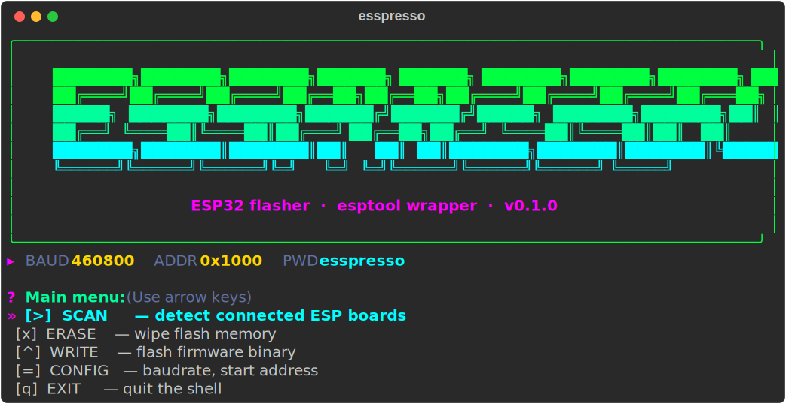

# esspresso

An interactive terminal UI for flashing ESP32 boards — a friendly wrapper
around [`esptool`](https://github.com/espressif/esptool) with menus, colors,
and translated error hints.



## Features

- Arrow-key-navigable main menu (shell-style REPL until you pick *Exit*).
- Auto-detection of connected boards on `/dev/ttyUSB*` and `/dev/ttyACM*`.
- **Compile Arduino sketches** (`*.ino`) via `arduino-cli` with a board (FQBN)
  picker for common ESP32 variants.
- **Smart firmware flashing:** when you pick a `*.ino.bin` that has a sibling
  `*.ino.bootloader.bin` and `*.ino.partitions.bin`, esspresso offers to flash
  all three at the canonical ESP32 offsets (`0x1000`/`0x8000`/`0x10000`) in a
  single `esptool` call. Otherwise falls back to single-binary flash at a
  configurable address.
- Erase flash with confirmation.
- Shell-like firmware picker: navigate directories with arrow keys, descend
  into subdirs, `.bin` files highlighted in green; optional custom-path fallback
  with tab completion.
- Configurable defaults (baudrate, start address, FQBN) kept in memory for the
  session.
- Human-readable error panels for the usual failure modes: BOOT button not
  held, serial port permission denied, port busy, `esptool` missing, ESP32
  core not installed.

## Requirements

- Linux (serial port discovery looks for `/dev/ttyUSB*` and `/dev/ttyACM*`).
- Python 3.10 or newer.
- [`uv`](https://docs.astral.sh/uv/) — recommended, reads the committed
  `uv.lock` for reproducible installs.
- **Optional, only for the `BUILD` action:**
  [`arduino-cli`](https://arduino.github.io/arduino-cli/latest/installation/)
  with the ESP32 core installed:

  ```bash
  arduino-cli config init --additional-urls https://espressif.github.io/arduino-esp32/package_esp32_index.json
  arduino-cli core update-index
  arduino-cli core install esp32:esp32
  ```

## Install

```bash
git clone https://github.com/heltonmaia/esspresso.git
cd esspresso
uv sync
```

`uv sync` creates a local `.venv/` and installs the pinned versions from
`uv.lock`, including `esptool` itself.

## Run

Without activating the venv:

```bash
uv run esspresso
```

Or, if you prefer an activated shell:

```bash
source .venv/bin/activate
esspresso
```

## Arduino sketch workflow

If your source is a `.ino` sketch (not a pre-built `.bin`):

1. `cd` into the sketch directory (where `YourSketch.ino` lives).
2. Run `esspresso` (or `uv run esspresso`).
3. Pick `[c]  BUILD`, choose the board variant (esp32, esp32s3, …) — esspresso
   calls `arduino-cli compile --output-dir build .`, producing
   `build/YourSketch.ino.bin` together with the bootloader and partitions.
4. Pick `[^]  WRITE`, browse into `build/`, select `YourSketch.ino.bin`.
   esspresso detects the triplet automatically and offers the full 3-binary
   flash.

## Serial port permissions

On most Linux distros your user needs to be in the `dialout` group to access
`/dev/ttyUSB*`:

```bash
sudo usermod -aG dialout $USER
```

Log out and back in after running this.

## Flashing tips

- Many ESP32 boards require holding the **BOOT** button (and briefly tapping
  **EN**/**RST**) to enter the bootloader before erase or write.
- Close any serial monitor or IDE that might be holding the port before
  flashing.
- If the default baudrate (460800) fails, try a lower one (115200) from the
  *Settings* menu.

## License

[MIT](LICENSE) © [Helton Maia](https://heltonmaia.com) — helton.maia@ufrn.br
